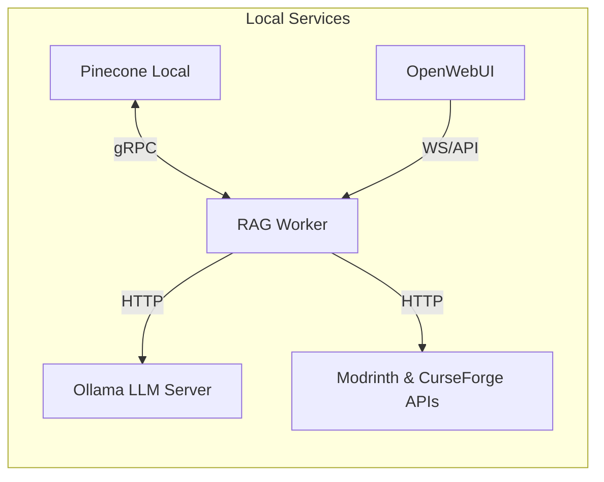

# Minecraft Mod Helper AI Chatbot

A fully-local Retrieval-Augmented-Generation (RAG) chatbot that answers questions about Minecraft mods and modpacks. Built with open-source LLMs (via Ollama), Pinecone Local vector store, and a lightweight Python ingestion pipeline.

---

## 📋 Table of Contents

- [🚀 Features](#🚀-features)  
- [🛠️ Installation](#🛠️-installation)  
- [⚙️ Usage](#⚙️-usage)  
- [🛣️ Roadmap & Checklist](#🛣️-roadmap--checklist)  
- [🧩 Architecture Overview](#🧩-architecture-overview)  
- [🤝 Contributing](#🤝-contributing)  
- [📝 License](#📝-license)  

---

## 🚀 Features

- **Local-first**: Runs entirely on your machine—no cloud keys or telemetry.  
- **Open-source LLMs**: Powered by Meta Llama 3 (via Ollama) or other local models.  
- **Pinecone Local**: Vector store for embeddings; supports full index mgmt.  
- **Automated Ingestion**:  
  - Parses CurseForge/Modrinth modpack manifests.  
  - Fetches mod metadata via APIs.  
  - Extracts pack-specific overrides from KubeJS & config.  
- **RAG Q&A**:  
  - Semantic retrieval of mod/pack docs.  
  - Prompts local LLM with retrieved context for accurate answers.  
- **Docker Compose**: One-command stack for Pinecone, Ollama, OpenWebUI, and RAG worker.  

---

## 🛣️ Roadmap & Checklist

### ✅ Completed Features
- [x] Docker Compose stack for Pinecone Local, Ollama, OpenWebUI, RAG worker  
- [x] `ingest_pack.py` CLI with `--zip` and `--pack` modes  
- [x] Base-mod Markdown generation from Modrinth API  
- [x] Pack overview Markdown from manifest  
- [x] Override JSON extraction from `/kubejs` (removeRecipe)  
- [x] Pinecone index creation & upsert via LangChain embeddings  
- [x] Simple UpsertTest script and CI sanity checks  

### 🚧 In Progress / Short-Term
- [ ] **Enhanced override parsing**: CraftTweaker scripts, datapack JSON, server ban-lists  
- [ ] **Version-aware retrieval**: Tag docs by Minecraft & mod version metadata  
- [ ] **Agent tool-calling**: Allow LLM to trigger live ingestion when unknown packs appear  
- [ ] **Frontend integration**: Custom OpenWebUI plugin for live doc upload  

### 📅 Future / Nice-to-Have
- [ ] **Discord/Slack bot** integration for in-game chat queries  
- [ ] **Automated nightly snapshots** of Pinecone vectors to disk  
- [ ] **Unit & regression tests** for ingestion & retrieval pipelines  
- [ ] **Deployment templates**: Kubernetes manifests / AWS CDK for cloud variant  

---

## 🧩 Architecture Overview

1. Ingest: ingest_pack.py writes docs to /data, embeds text, upserts to Pinecone.

2. Serve: server.py (FastAPI) handles chat requests, performs RAG retrieval, queries Ollama.

3. UI: OpenWebUI connects to Ollama + allows uploading local docs/tools for agent.

---

## 📝 License

This project is licensed under the MIT License.
© 2025 Saad Ismail.
