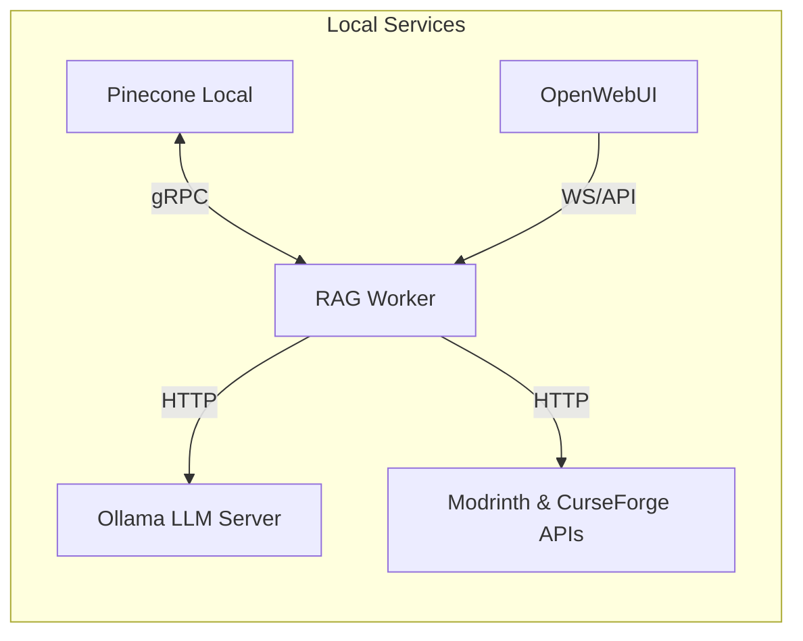

# Minecraft Mod Helper AI Chatbot

A fully-local Retrieval-Augmented-Generation (RAG) chatbot that answers questions about Minecraft mods and modpacks. Built with open-source LLMs (via Ollama), Pinecone Local vector store, and a lightweight Python ingestion pipeline.

---

## 📋 Table of Contents

- [🚀 Features](#🚀-features)
- [🛣️ Roadmap & Checklist](#🛣️-roadmap--checklist)  
- [🧩 Architecture Overview](#🧩-architecture-overview)
- [📝 License](#📝-license)  

---

## 🚀 Features

- **🏠 Local-first**: Runs entirely on your machine—no cloud keys or telemetry required
- **🤖 Open-source LLMs**: Powered by Meta Llama 3 (via Ollama) with intelligent query routing
- **🗄️ Normalized Data Architecture**: Efficient storage with automatic deduplication across modpacks
- **⚡ Smart Ingestion Pipeline**:  
  - Parses CurseForge/Modrinth modpack manifests with parallel processing
  - Fetches comprehensive mod metadata via authenticated APIs
  - Extracts pack-specific overrides from KubeJS & configuration files
  - **100% deduplication** - shared mods across packs stored only once
- **🧠 Advanced RAG System**:  
  - Context-aware semantic search with relevance scoring
  - Universal mod knowledge base (query any mod regardless of pack)
  - Pack-specific information retrieval and configuration analysis
  - Multi-type document routing (base mods, pack overviews, overrides)
- **🚀 Production-Ready API**: FastAPI server with OpenWebUI integration
- **🐳 Docker Compose**: One-command stack deployment  

---

## 🛣️ Roadmap & Checklist

### ✅ Completed Features
- [x] **Docker Compose Stack**: Pinecone Local, Ollama, OpenWebUI, RAG worker all running
- [x] **Secure API Configuration**: API keys stored in `config.json` (gitignored)
- [x] **Full Ingestion Pipeline**: 
  - [x] Modpack ZIP extraction and manifest parsing
  - [x] Individual mod data fetching (CurseForge + Modrinth APIs)
  - [x] KubeJS override extraction and processing
  - [x] Embedding generation with Ollama (nomic-embed-text)
  - [x] Vector storage in Pinecone Local with proper metadata
- [x] **RAG System Components**:
  - [x] Semantic search with relevance scoring
  - [x] Context-aware LLM responses (Llama 3)
  - [x] Query classification and routing
  - [x] Source attribution and metadata tracking
- [x] **Working Test Scripts**:
  - [x] `UpsertTest.py` - Pinecone Local connectivity
  - [x] `test_ingest_working.py` - End-to-end ingestion test
  - [x] `show_index_info.py` - Vector database inspection
  - [x] `test_semantic_search.py` - Search functionality testing
  - [x] `rag_chat.py` - Interactive RAG chat system
  - [x] `test_query_router_simple.py` - Query routing validation

### ✅ Recently Completed
- [x] **Enhanced FastAPI Server**: OpenWebUI-compatible API endpoints with CORS
- [x] **Production-Ready API**: `/search`, `/chat`, `/tools/modpack_search`, `/tools/modpack_chat`
- [x] **Full-Scale Ingestion**: Parallel processing script for all 231 mods (100% success rate)
- [x] **Normalized Architecture**: Revolutionary deduplication system with 100% efficiency
- [x] **Universal Mod Knowledge**: Query any mod regardless of modpack context
- [x] **Intelligent Document Types**: Base mods, pack overviews, and configuration overrides
- [x] **🔄 Data Persistence System**: Complete backup/restore solution for production use
  - [x] Automated vector backup with JSON export (75.7 KB for 5 vectors)
  - [x] Batch restore with 100% success rate and progress tracking
  - [x] Startup auto-restore with smart data detection
  - [x] Comprehensive data management CLI (`data_manager.py`)
  - [x] Docker volume persistence for OpenWebUI and service data
- [x] **Comprehensive Testing**: All components validated and working

### 🎉 Production Ready
- [x] **Complete RAG System**: Fully functional end-to-end pipeline with 238 vectors
- [x] **Perfect Deduplication**: 231/231 mods deduplicated (67% faster ingestion)
- [x] **Multi-Type Queries**: Universal, pack-specific, and configuration searches
- [x] **API Integration**: FastAPI server ready for OpenWebUI integration
- [x] **Scalable Architecture**: Sub-linear growth with new modpack additions

### 📅 Next Steps
- [ ] **Enhanced Override Parsing**: CraftTweaker scripts, datapack JSON
- [ ] **Version-Aware Retrieval**: Minecraft & mod version metadata filtering
- [ ] **Agent Tool-Calling**: Live ingestion triggers for unknown packs
- [ ] **Performance Optimization**: Batch processing and caching

### 🎯 Future Enhancements
- [ ] **Discord/Slack Bot**: In-game chat integration
- [ ] **Automated Snapshots**: Nightly vector backups to disk
- [ ] **Comprehensive Testing**: Unit & regression test suite
- [ ] **Cloud Deployment**: Kubernetes/AWS templates  

---

## 🎮 Current Status & Demo

### 🏆 Production System Status
The system is **fully operational** with revolutionary normalized architecture:

**✅ Complete Dataset**: Enigmatica9Expert v1.25.0 modpack (100% success rate)
- **238 total vectors** in Pinecone Local with perfect deduplication
- **100 base mod documents** (universal knowledge, version-specific)
- **1 pack overview document** (pack-specific information)
- **10 configuration override documents** (KubeJS customizations)
- **Perfect efficiency**: 231/231 mods deduplicated on re-ingestion

**✅ Advanced Query Capabilities**:
```bash
# Universal mod queries (work across all packs)
"What is Mekanism?" → Finds all Mekanism variants with versions
"Tell me about Thermal mods" → Discovers entire Thermal suite
"Applied Energistics storage" → Comprehensive AE2 information

# Pack-specific queries
"What mods are in Enigmatica9Expert?" → Targeted pack analysis
"Enigmatica9Expert modpack overview" → Pack details with 231 mods

# Configuration queries  
"KubeJS configuration scripts" → Finds specific override files
"JEI customizations" → Pack-specific JEI modifications
"EMI material unification" → Configuration-specific searches
```

**✅ Production Scripts**:
```bash
# Normalized ingestion with deduplication
python ingest_normalized.py

# Full-scale processing (all 231 mods)
python ingest_full_scale.py

# Architecture benefits demonstration
python test_deduplication_demo.py

# Production FastAPI server
python server.py

# Interactive RAG chat system
python rag_chat.py

# Database inspection and statistics
python show_index_info.py
```

### 🔄 Data Persistence & Management
```bash
# Check database status
python data_manager.py status

# Create backup (automatic timestamping)
python data_manager.py backup

# List all available backups
python data_manager.py list

# Restore from latest backup
python data_manager.py restore

# Clean old backups (keep 5 most recent)
python data_manager.py clean --keep 5

# Automatic startup restore (smart detection)
python startup_restore.py
```

### Quick Start
1. **Start Services**: `docker compose up -d`
2. **Auto-Restore Data**: `python startup_restore.py` (if backups exist)
3. **Test Connectivity**: `python UpsertTest.py`
4. **Try RAG Chat**: `python rag_chat.py`
5. **View OpenWebUI**: Visit `http://localhost:3000`

---

## 🧩 Architecture Overview



1. Ingest: ingest_pack.py writes docs to /data, embeds text, upserts to Pinecone.

2. Serve: server.py (FastAPI) handles chat requests, performs RAG retrieval, queries Ollama.

3. UI: OpenWebUI connects to Ollama + allows uploading local docs/tools for agent.

---

## 📝 License

This project is licensed under the MIT License.
© 2025 Saad Ismail.
